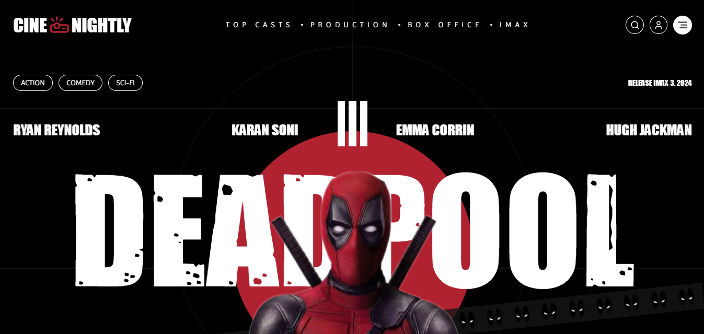

# [Landing Page temática do Deadpool](https://cinema-lp.vercel.app/)
[](https://cinema-lp.vercel.app/)

## Sobre ✏️
### A CINE NIGHTLY, empresa fictícia criada para o projeto, é uma plataforma de compra de ingressos, e para chamar a atenção dos clientes, teve-se a ideia de personalizar o site com um filme popular, assim, gerando uma boa impressão pro usuário que irá realizar a compra.

## Tecnologias 💻
<div>
  <abbr title="Next - Framework javascript" >
    
  </abbr>
  <abbr title="React - Framework javascript" >
    
  </abbr>
  <abbr title="Typescript - Linguagem fortemente tipada" >
    
  </abbr>
</div>

## Bibliotecas 📚
<div>
  <abbr title="Tailwind CSS - Biblioteca de estilização" >
    
  </abbr>
  <abbr title="Postcss - Biblioteca para minimizar o css" >
    
  </abbr>
  <abbr title="GSAP - Biblioteca para criar animações" >
    
  </abbr>
  <abbr title="Lucide - Biblioteca de ícones" >
    
  </abbr>
</div>

## Rodando Localmente (Prompt) 📟
### Clone o projeto
```bash
  git clone https://github.com/Paulo-Mikhael/cinema-lp
```
### Entre no diretório do projeto
```bash
  cd cinema-lp
```
### Instale as dependências
```bash
  npm install
```
### Inicie o servidor
```bash
  npm run dev
```

## Talvez você queira ver 💡
  ### [Portifólio](https://portifolio-react-three.vercel.app/)
  ### [Currículo](https://docs.google.com/document/d/1xhimUtV6EM7c1GtwBwAHsIonX1HjoLSi/edit)

## Confira meus outros projetos 🛠️
  - [in.orbit (back-end) - Aplicação de metas pessoais](https://github.com/Paulo-Mikhael/in-orbit-backend?tab=readme-ov-file#readme)
  - [in.orbit (front-end) - Aplicação de metas pessoais](https://github.com/Paulo-Mikhael/in-orbit-frontend?tab=readme-ov-file#readme)
  - [PHLOX Blog - Blog de uma empresa de tecnologia](https://github.com/Paulo-Mikhael/phlox-blog?tab=readme-ov-file#readme)
  - [Fastask - Gerenciador de Tarefas](https://github.com/Paulo-Mikhael/fastask?tab=readme-ov-file#readme)
  - [Landing Page para uma academia](https://github.com/Paulo-Mikhael/academia-landing-page?tab=readme-ov-file#readme)
  - [Landing Page para um e-commerce de plantas](https://github.com/Paulo-Mikhael/casa-verde?tab=readme-ov-file#readme)

## Contatos 📞
  [](https://portifolio-react-three.vercel.app/contacts)
  [](https://www.linkedin.com/in/paulo-miguel-4b706022b/)
  [](https://www.instagram.com/pa__miguel?igsh=MWxoYzdqNGluZWcyaA%3D%3D)
  [](https://api.whatsapp.com/send/?phone=5592992813253&text=Ol%C3%A1%21+Gostaria+de+fazer+uma+oferta...&type=phone_number&app_absent=0)